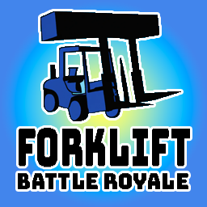

  

<h1 align="center">Forklift Battle Royale</h1>

This is a super basic multiplayer battle royale type thing I created to help teach JavaScript learners about the relevance of data structures and OOP. It's not the best code, but it's not the worst either. Keep in mind this was thrown together in a few hours, so a lot of stuff like client side prediction and interpolation is missing. I might consider adding that stuff in the future, but for now, this is what we have. I'm not going to be updating this much, but feel free to fork it and make your own version. I'd love to see what you come up with!

> The server side code is pretty clean, but the client side code is a *bit* messy. I might clean it up in the future, but for now, it's fine.

https://github.com/cooper-ross/forklift-battle-royale/assets/120236631/d24727bc-d605-4e0b-b7ba-cc7d43fc2ef1

## Performance details
- The server can handle about 8 players per 1024 MB of RAM, which is about 128 MB per player, so not bad at all
- The tick speed is 60 ticks per second, which is pretty good for a game like this, especially since there's no interpolation.
- There is no client side prediction, so the game will feel a bit laggy on high ping, but it's not too bad.

## Other notes
- Pretty much everything is handled on the server, but cheats can still be made since the client is sent all the players positions and stuff. I might add some server side checks in the future, but for now, it's just a fun little project. Maybe even try to make your own cheat, it's not too hard. There's already a cheat for users named John I added for fun.

## How does it work?
- The server is written in node.js, and uses socket.io for networking
- The client is written in plain old vanilla js, and also uses socket.io for networking
- The server handles all the game logic, and the client just renders the game state it recives from the server
- The client also sends a movement packet to the server every tick, which the server uses to update the player position
- The server sends the game state to the client every tick, which the client uses to render the game
* The game state is simplified from what the server actually uses, since the client doesn't need to know everything the server does
* The server uses a game loop to update the game state every tick, and then sends the game state to the client
* The client uses a render loop to render the game state every tick, and then sends the movement packet to the server

## How do I run this locally?
- Clone the repo, or fork the replit
- Run `npm install` to install dependencies
- Run `node index.js` to start the server, or just press the start button on replit
- Open `localhost:4000` in your browser to play.

If you want to play with others, you'll need to get them to use your localhost. Using the same adress won't work: you need to find what your local network's IP of that computer is. Then other people can access to your site by that IP.
You can find your local network's IP by go to Command Prompt or press Windows + R then type in ipconfig. It will give out some information and your local IP should look like 192.168.1.x.
Additionally, make sure your firewall allows incoming connections to your local server. On Windows, you may have already allowed this at install time, but possibly for private networks only. If the connection isn't working, an easy fix might be to ensure your host PC's network connection is set as private, and if it is but the connection still isn't working, take a look at your application firewall settings.

## Dependencies
- node.js
- npm
- socket.io
- express
